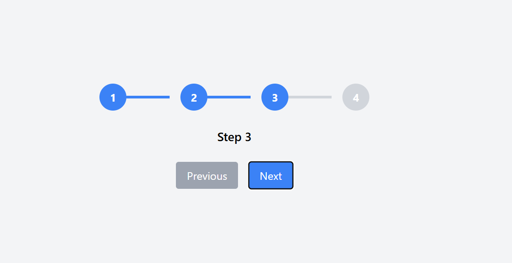

# Stepper-React-Step_React_TimelineType_Step



```react.js


import React, { useState } from "react";

const Stepper = () => {
  const [currentStep, setCurrentStep] = useState(1); // Track the current step

  const steps = ["Step 1", "Step 2", "Step 3", "Step 4"]; // Step labels

  // Function to move to the next step
  const nextStep = () => {
    if (currentStep < steps.length) {
      setCurrentStep(currentStep + 1);
    }
  };

  // Function to move to the previous step
  const prevStep = () => {
    if (currentStep > 1) {
      setCurrentStep(currentStep - 1);
    }
  };

  return (
    <div className="flex flex-col items-center justify-center min-h-screen bg-gray-100 p-4">
      {/* Stepper */}
      <div className="flex items-center justify-center space-x-4">
        {steps.map((step, index) => {
          const stepNumber = index + 1;
          return (
            <div key={index} className="flex items-center">
              {/* Step Circle */}
              <div
                className={`w-10 h-10 flex items-center justify-center rounded-full text-white font-bold ${
                  currentStep >= stepNumber
                    ? "bg-blue-500"
                    : "bg-gray-300 text-gray-500"
                }`}
              >
                {stepNumber}
              </div>

              {/* Step Label */}
              {index !== steps.length - 1 && (
                <div
                  className={`h-1 w-16 ${
                    currentStep > stepNumber
                      ? "bg-blue-500"
                      : "bg-gray-300"
                  }`}
                ></div>
              )}
            </div>
          );
        })}
      </div>

      {/* Step Description */}
      <p className="mt-6 text-lg font-semibold">
        {steps[currentStep - 1]}
      </p>

      {/* Navigation Buttons */}
      <div className="flex space-x-4 mt-6">
        <button
          onClick={prevStep}
          className="bg-gray-400 text-white px-4 py-2 rounded hover:bg-gray-500 disabled:bg-gray-300"
          disabled={currentStep === 1}
        >
          Previous
        </button>
        <button
          onClick={nextStep}
          className="bg-blue-500 text-white px-4 py-2 rounded hover:bg-blue-600 disabled:bg-blue-300"
          disabled={currentStep === steps.length}
        >
          Next
        </button>
      </div>
    </div>
  );
};

export default Stepper;
```
